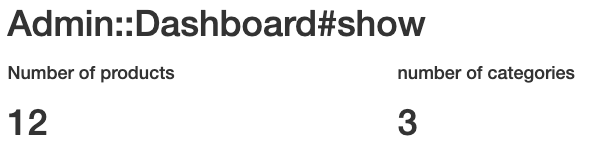

# Jungle

Jungle is a multipage e-commerce website application made with Ruby on rails. 

When the user visits the website they see all of the products that are avaible for purchase. Items have 0 stock in the database are flagged as sold out.

- - - -

Once a couple of items have been added to the cart, the user can view all of their items before checking out.

- - - -

Payments are processed using the Stripe API, you can test out payments using any of stripes test cards. see below

- - - -

## User Login
When users register their information is saved to the database. Passwords are saved using bcrypt hashing. A new session is created until they log out.

## Admin 
- - - -
A brief summary of the store can be found in the admin dashboard

- - - -

The admin product page shows all the products, stock levels, and you may delete items if they are no longer offered.

- - - -
Creating a new product is easy, just fill in a couple text fields

- - - -

Use the admin categories page to create a new category items can have

- - - - 

Overall creating this project was a good experience. It was tough working on an inherited code base, but by the end I was relatively familiar with all the different components of the project. 

Some features i'd like to build in the future are 
* updating the stock levels of the products when someone makes a purchase
* create a more modern front end with Material UI 

## Additional Steps for Apple M1 Machines

1. Make sure that you are runnning Ruby 2.6.6 (`ruby -v`)
1. Install ImageMagick `brew install imagemagick imagemagick@6 --build-from-source`
2. Remove Gemfile.lock
3. Replace Gemfile with version provided [here](https://gist.githubusercontent.com/FrancisBourgouin/831795ae12c4704687a0c2496d91a727/raw/ce8e2104f725f43e56650d404169c7b11c33a5c5/Gemfile)

## Setup

1. Run `bundle install` to install dependencies
2. Create `config/database.yml` by copying `config/database.example.yml`
3. Create `config/secrets.yml` by copying `config/secrets.example.yml`
4. Run `bin/rake db:reset` to create, load and seed db
5. Create .env file based on .env.example
6. Sign up for a Stripe account
7. Put Stripe (test) keys into appropriate .env vars
8. Run `bin/rails s -b 0.0.0.0` to start the server

## Stripe Testing

Use Credit Card # 4111 1111 1111 1111 for testing success scenarios.

More information in their docs: <https://stripe.com/docs/testing#cards>

## Dependencies

* Rails 4.2 [Rails Guide](http://guides.rubyonrails.org/v4.2/)
* PostgreSQL 9.x
* Stripe
